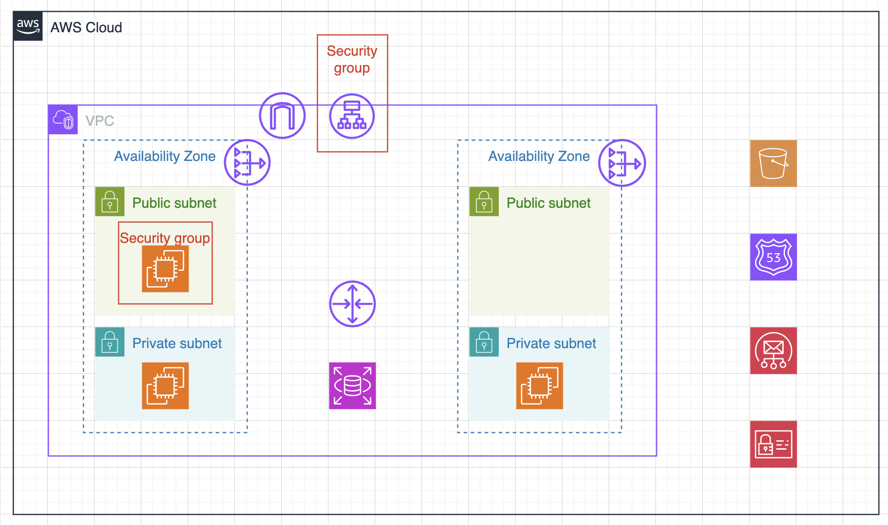

# AWS編
[backend API](https://www.trustynews.net/articles)

# 現段階で実装できているところ
* articles#index

# これから実装するところ
* articles controllerのindex アクション以外

# 新しく改善したところ
* routes.rbをresourcesメソッドで実装
* modelで関連付けを実装